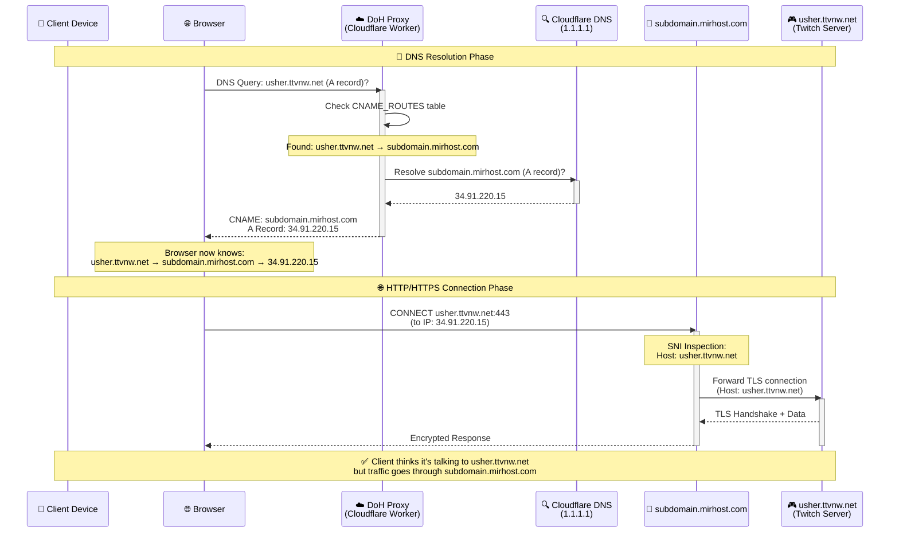
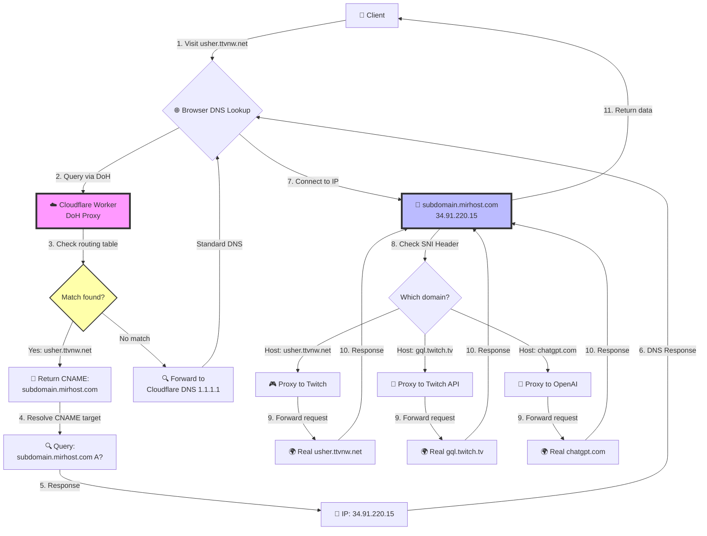
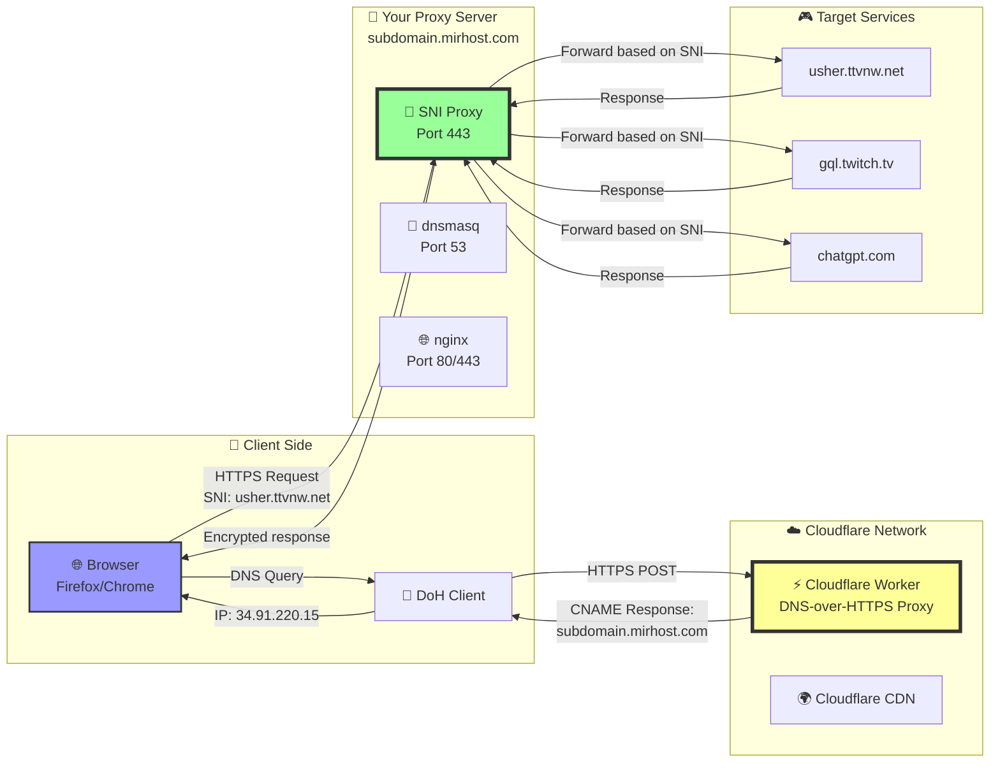
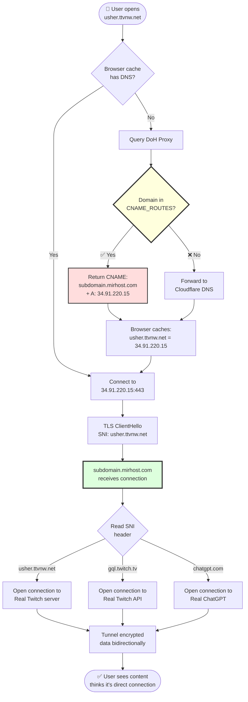
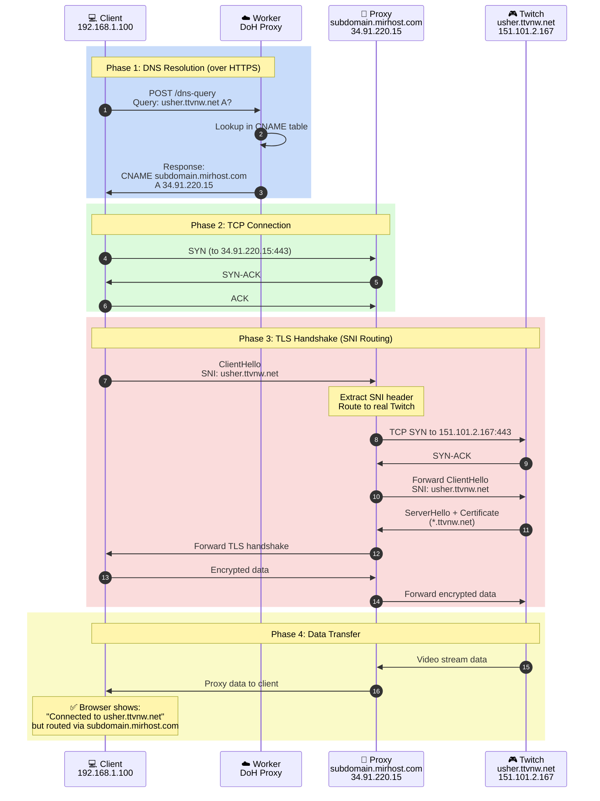
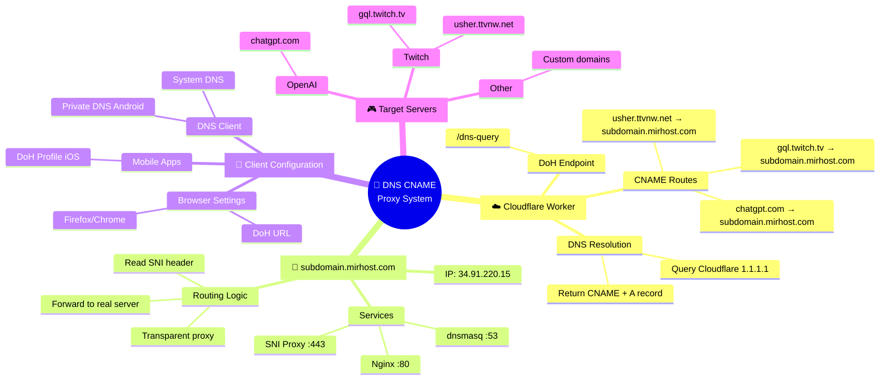

# 🔄 DNS CNAME Proxy Architecture

## **Mermaid Sequence Diagram:**

---

## **Flow Diagram:**

---

## **Architecture Overview:**

---

## **Data Flow Diagram:**

---

## **Network Packet Flow:**

---

## **Configuration Map:**

---

## **How It Works - Simple Explanation:**

1. **Client asks**: "What's the IP of `usher.ttvnw.net`?"
2. **DoH Proxy responds**: "It's a CNAME to `subdomain.mirhost.com` which is `34.91.220.15`"
3. **Client connects** to `34.91.220.15` but sends SNI header: `usher.ttvnw.net`
4. **SNI Proxy reads** the SNI header and forwards to the real Twitch server
5. **Data flows** through your proxy transparently
6. **Client thinks** it's connected directly to Twitch!
